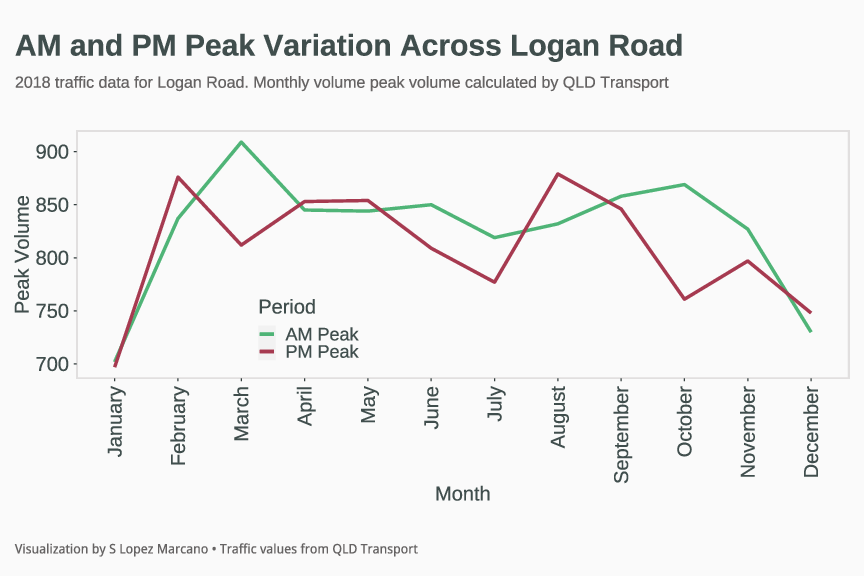

# Brisbane Traffic in 2018
Brisbane is a rapidly growing metropolitan city in Australia, and in 2032 they will host the olympics. Brisbane's traffic has been getting worse throughout the years and road infrastucture cannot withstand the current and project traffic volume. 

I wanted to understand how Brisbane traffic was in previous years, and then compare it with current data. Data for 2021, 2022 or even 2023 is yet to be made available by the Open Data team at Queensland Department of Transport. I was able to access the 2018 data, specifically the peak volume for AM and PM across all key QLD corridors. 

As of 08032023, I am focusing my analysis on Logan Road, one of the longest corridors in Brisbane, but also one that I use frequently in my daily commute. 

What I find interesting from this graph is March data. You would expect that if traffic in Logan Road increased in March during AM hours (maybe due to x y z), then we would expect the same people to be using the corridor at PM hours. Now, low traffic during PM hours may be related to roadworks and lane closures that potentially were not present during AM hours. 

Contrary to above, in August you can see how the PM peak is higher than the AM peak. 

Overall, there are spikes in car volume throughout the year, but it is very cler than traffic in Logan Road decreases from October until January (summer holidays). 

